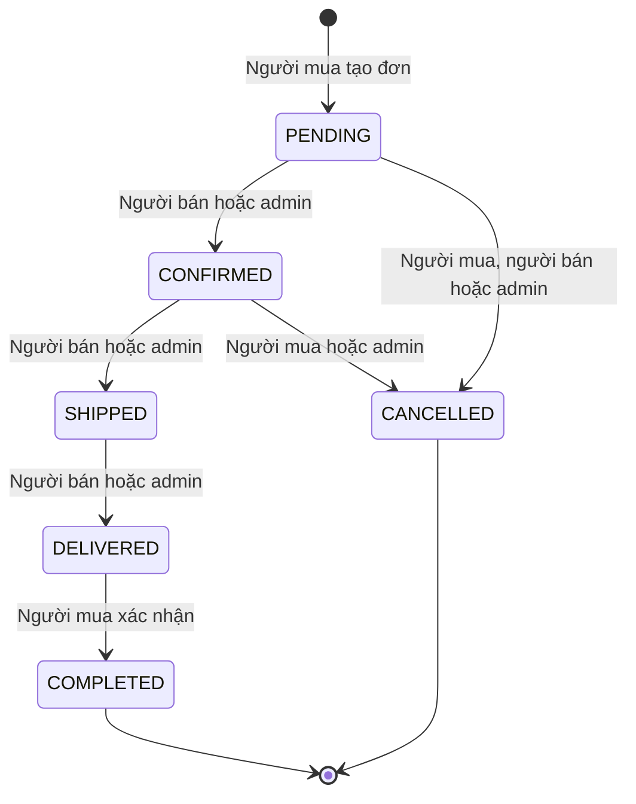

# 02 — Yêu cầu và quy tắc nghiệp vụ

## Phạm vi theo vai trò

| Vai trò/ngữ cảnh | Chức năng cần có | Giới hạn quyền |
| --- | --- | --- |
| Khách | Trang chủ, danh mục, mới/nổi bật, tìm từ khóa, lọc danh mục/giá/tình trạng, chi tiết sản phẩm và liên hệ công khai người bán | Chỉ tin PUBLIC + APPROVED của người bán ACTIVE; không xem địa chỉ giao hàng/ảnh khiếu nại |
| USER — tài khoản | Đăng ký, đăng nhập/đăng xuất, sửa hồ sơ; một tài khoản vừa mua vừa bán | Chỉ hồ sơ mình; không tự sửa role/status |
| USER — mua | Giỏ hàng thêm/xóa/đổi số lượng/tổng; checkout thông tin nhận hàng; chọn COD/chuyển khoản mô phỏng; xem đơn và lịch sử; hủy hợp lệ; xác nhận nhận; review; khiếu nại và tiến độ | Chỉ đơn `buyer_id` của mình, không mua sản phẩm mình |
| USER — bán | Đăng tin có danh mục/giá/mô tả/tình trạng/số lượng/ảnh; sửa/ẩn tin; cập nhật còn hàng/đã bán; xem đơn bán, giao hàng, thanh toán mô phỏng và trạng thái được phép | Chỉ sản phẩm `seller_id` và đơn `seller_id` của mình; không tự duyệt tin |
| ADMIN | Xem/quản lý mọi sản phẩm: thêm thay mặt người bán, sửa, ẩn, duyệt/từ chối; quản lý mọi đơn theo luật; xem snapshot/lịch sử/bằng chứng, phản hồi/kết luận khiếu nại | Không sửa snapshot/lịch sử cũ, không bỏ qua tồn kho hay tự mua; mọi can thiệp có người thực hiện và lý do |

Không có role BUYER/SELLER tách rời. Chỉ `USER` và `ADMIN`; mua/bán là quan hệ với tài nguyên. ADMIN vẫn có thể dùng luồng USER nhưng chịu mọi luật mua/bán. Không mở thêm màn hình quản trị người dùng vượt phạm vi; cột status/role được chuẩn bị để seed admin và ngừng hoạt động khi cần.

## Quy tắc tài khoản đã triển khai tại M2

- Email là định danh đăng nhập; trim/lowercase, tối đa 254 ký tự, local part tối đa 64 ký tự, dạng ASCII thông thường có domain chứa dấu chấm; không hỗ trợ quoted local part/IDN trong MVP. DB UNIQUE email vẫn quyết định xung đột kể cả đăng ký đồng thời.
- Đăng ký nhận họ tên 2–100 ký tự, email, phone tùy chọn (9–15 chữ số, có thể có dấu +), mật khẩu ít nhất 8 ký tự Unicode/tối đa 72 byte UTF-8 và xác nhận khớp. Mật khẩu không trim/cắt; BCrypt 2b cost 12 như seed. Role/status do server cố định USER/ACTIVE.
- Hồ sơ sửa display_name, phone, public_contact (tối đa 255 ký tự). Email là readonly; đổi email cần xác minh riêng ngoài M2. Không sửa mật khẩu, role/status ở form này. ID lấy từ session; DTO không có ID/quyền/status do client cung cấp.
- Đăng nhập chỉ ACTIVE; thất bại dùng cùng thông báo cho email không tồn tại/sai mật khẩu/ngừng hoạt động. Session đổi ID và CSRF token khi login, timeout 30 phút không hoạt động; logout POST hủy session. Filter đọc lại ACTIVE và role từ DB, không dùng role cũ trong session để cho phép admin.
- GET/POST các tuyến account/admin/seller/buyer/cart/checkout được kiểm đăng nhập ở server; admin yêu cầu ADMIN. POST có CSRF, lỗi form trả 400, CSRF/quyền trả 403, DB không sẵn sàng trả 503; POST thành công redirect 303. JSP escape dữ liệu, không gửi lại password.

## Các điểm chưa được đặc tả và giả định đề xuất

Những quyết định dưới đây **chưa được người dùng chốt**, là cơ sở thiết kế nhất quán để triển khai sau. Không cần trả lời ngay trong lượt đầu.

| Điểm còn thiếu/khả năng mâu thuẫn | Đề xuất MVP | Nếu thay đổi |
| --- | --- | --- |
| Thương hiệu/ngành hàng | Tên trung tính “Chợ C2C”; hàng hóa hữu hình thông thường, danh mục một cấp | Thay nội dung/seed, thuộc tính và quy tắc upload/kiểm duyệt |
| Tiền tệ, vận chuyển, phí | VND, giá nguyên đồng; chưa thu phí nền tảng/thuế; phí vận chuyển **0** hiển thị rõ; không tích hợp hãng vận chuyển | Bổ sung phí theo từng đơn bán và snapshot phí, không cộng phí một lần vào checkout nhiều người bán |
| Tình trạng hàng | NEW / LIKE_NEW / USED; số lượng theo đơn vị chiếc | Danh mục đặc thù có thể cần hạn sử dụng, bảo hành, kích cỡ/biến thể/serial |
| Nổi bật | ADMIN bật `is_featured`; vẫn lọc điều kiện công khai/còn hàng khi hiển thị | Không suy ra “bán chạy” từ lượt xem/AI |
| Liên hệ công khai | Tên hiển thị và `public_contact` người bán tự cung cấp; email đăng nhập, địa chỉ giao hàng là riêng tư | Thêm cơ chế đồng ý nếu công khai thêm dữ liệu |
| Giỏ hàng | Lưu DB cho USER đăng nhập; không có guest checkout; checkout toàn bộ giỏ hợp lệ | Guest cart/merge để ngoài MVP |
| Giá thay đổi lúc checkout | Server lập bản xem lại; nếu giá/nội dung tin đổi trước POST thì trả thông báo xem lại, chưa tạo đơn | Dùng listing_version; không tin giá hoặc tổng từ client |
| Tách nhiều người bán | Một checkout → một đơn/người bán; tạo toàn bộ trong một transaction; phương thức/địa chỉ ban đầu dùng chung, snapshot riêng từng đơn | Sau tạo đơn, các đơn xử lý/hủy/thanh toán độc lập |
| Giữ số lượng khi chờ xác nhận | Trừ khả dụng ngay lúc tạo đơn; chưa tự hết hạn; người mua/người bán có thể hủy PENDING | Nếu cần timeout, thêm expires_at và job hủy dùng cùng luật, không chỉ sửa cột stock |
| “Đã bán” và tồn kho | Nhãn “Hết hàng/Đã bán” suy ra stock_quantity = 0; thao tác “đã bán” là điều chỉnh khả dụng về 0 có lý do | Hàng còn vật lý nhưng đang giữ cho đơn cũng không được mua tiếp; không dùng status độc lập gây lệch kho |
| Kiểm duyệt và chỉnh sửa | Tin mới PENDING. Sửa tên/mô tả/danh mục/giá/tình trạng/ảnh → PENDING lại; đổi kho/liên hệ/ẩn không tự duyệt | Chưa có lưu nhiều bản tin chờ duyệt; đơn cũ dùng snapshot |
| Admin thêm sản phẩm | Phải chỉ định một seller ACTIVE; không tạo sản phẩm vô chủ. Seller của tin bất biến | Thay chủ cần nghiệp vụ riêng, ngoài MVP |
| Ai ghi “đã giao” | Người bán/admin ghi mô phỏng giao hàng; người mua xác nhận để COMPLETED | Nhãn rõ không có xác nhận từ hãng vận chuyển |
| Hủy khi đã giao/đã hoàn thành | Không hủy trực tiếp từ SHIPPED trở đi; gửi khiếu nại | Đổi/trả, hoàn kho sau giao, hoàn tiền thật nằm ngoài MVP |
| Review sản phẩm/người bán | Một review/order_item có `product_rating`, `seller_rating` và một nhận xét | Không thêm review độc lập không gắn đơn; seller average tính từ seller_rating hợp lệ |
| Chỉnh/sửa review | MVP đăng một lần, không sửa/xóa từ người mua; admin có thể ẩn nội dung không phù hợp và ghi lý do | Nếu cho sửa cần version/history, không làm mất nội dung ban đầu |
| Số khiếu nại/thời hạn | Một hồ sơ/order trong MVP, cho mở ở mọi trạng thái kể cả PENDING/CANCELLED/COMPLETED; không có hạn ngày | Hồ sơ đã xử lý được admin mở lại khi có bằng chứng mới, lịch sử được giữ |
| Khiếu nại ảnh hưởng đơn | Không tự hủy/hoàn kho. Chặn COMPLETED trong khi hồ sơ RECEIVED/PROCESSING; vẫn có thể tiến hành giao nếu phù hợp | Người mua không phải xác nhận nhận để được khiếu nại; sau giải quyết có thể xác nhận |
| Phản hồi người bán về khiếu nại | Admin phản hồi, người mua xem/bổ sung bằng chứng khi hồ sơ còn mở; chưa có thread trả lời từ seller | Seller chỉ biết cảnh báo đơn đang có khiếu nại, không được lấy bằng chứng riêng tư |
| Tài khoản ngừng hoạt động | Không đăng nhập/mua/đăng bán mới; admin xử lý đơn đang có theo cùng luật | Ngừng hoạt động không tự xóa đơn, trả kho hay đổi trạng thái |

## Trạng thái sản phẩm

- `visibility`: PUBLIC / HIDDEN — ý định công khai của seller/admin.
- `moderation_status`: PENDING / APPROVED / REJECTED — quyền kiểm duyệt của admin.
- `stock_quantity`: số lượng khả dụng; bằng 0 thì không mua. `availability` là nhãn suy ra IN_STOCK / OUT_OF_STOCK, không lưu thành cột độc lập.
- Tin được xem công khai khi PUBLIC + APPROVED + seller ACTIVE + category ACTIVE. Tin hết hàng có thể xem chi tiết với nút mua bị vô hiệu; danh sách trang chủ ưu tiên còn hàng.
- Sản phẩm bị ẩn/chờ duyệt sau khi có đơn không làm mất đơn; người bán vẫn phải xử lý đơn. Admin có thể hủy trước giao theo luật nếu tin vi phạm.

## Trạng thái đơn và quyền chuyển

| Chuyển | Người được thực hiện | Điều kiện/phụ tác động trong cùng transaction |
| --- | --- | --- |
| Mới → PENDING (Chờ xác nhận) | Buyer của checkout | Tồn đủ, tin hợp lệ, buyer != seller; trừ khả dụng, snapshot, tạo payment và history ban đầu |
| PENDING → CONFIRMED (Đã xác nhận) | Seller của đơn / admin | Chỉ từ PENDING; chuyển khoản chưa xác nhận có thể CONFIRMED nhưng chưa được giao |
| PENDING → CANCELLED (Đã hủy) | Buyer / seller của đơn / admin | Lý do bắt buộc; hoàn kho và void/refund mô phỏng tương ứng |
| CONFIRMED → CANCELLED | Buyer của đơn / admin | Chưa SHIPPED; lý do bắt buộc. Seller muốn hủy sau xác nhận phải nhờ admin xử lý, không có endpoint tự nhảy trạng thái |
| CONFIRMED → SHIPPED (Đang giao) | Seller của đơn / admin | Chuyển khoản phải PAID; COD còn UNPAID được phép; không trừ kho lần hai |
| SHIPPED → DELIVERED (Đã giao) | Seller của đơn / admin | Mô phỏng giao thành công; COD chuyển PAID và history thanh toán; không tự COMPLETED |
| DELIVERED → COMPLETED (Hoàn thành) | Buyer của đơn | PAID, không khiếu nại đang mở; timestamp nhận hàng; từ đây được review |

ADMIN được can thiệp các chuyển nêu rõ trong bảng, luôn có lý do; không tự xác nhận nhận hàng thay buyer, không SHIPPED → CANCELLED hay COMPLETED → PENDING. Hai request đua nhau phải khóa đơn/kiểm tra trạng thái trong transaction; một thắng, một nhận trạng thái mới. Request lặp cùng hành động đã xong không ghi history/phụ tác động lần hai. Request chuyển sai khác trả lỗi nghiệp vụ.

## Thanh toán mô phỏng độc lập với đơn

Mỗi đơn có một payment, amount bằng grand_total, VND, `is_simulated = true`, method COD hoặc BANK_TRANSFER_SIMULATED, không đổi method sau tạo đơn. Giao diện/phiếu đơn ghi rõ “Thanh toán mô phỏng — không chuyển tiền thật”.

| Luồng | Trạng thái payment | Quyền và điều kiện |
| --- | --- | --- |
| Tạo COD | UNPAID | Service tạo cùng đơn |
| Tạo chuyển khoản mô phỏng | PENDING_CONFIRMATION | Việc chọn phương thức chỉ ghi nhận chờ kiểm tra, không chứng minh đã trả tiền |
| Xác nhận chuyển khoản mô phỏng | PENDING_CONFIRMATION → PAID | Seller của đơn/admin thao tác xác nhận, chỉ PENDING/CONFIRMED, ghi người/lý do; buyer không gửi `status=PAID` |
| COD đã giao | UNPAID → PAID | Service thực hiện cùng SHIPPED → DELIVERED, mô phỏng thu tiền |
| Hủy khi chưa paid | UNPAID/PENDING_CONFIRMATION → VOIDED | Service hủy trước giao |
| Hủy đơn đã paid | PAID → REFUND_SIMULATED | Service/admin ghi mô phỏng hoàn trả trong hủy hợp lệ; không hoàn tiền thật |

PAID không tự hoàn thành đơn. VOIDED/REFUND_SIMULATED chỉ thuộc đơn CANCELLED trong MVP; không có nghiệp vụ hoàn tiền riêng sau giao. Amount không nhận từ client. Lịch sử payment giữ trạng thái trước/sau, người, thời gian, ghi chú.

## Review và khiếu nại

Review: buyer đăng nhập phải trùng order.buyer_id, item thuộc đơn đó, đơn COMPLETED và chỉ một review/order_item. Sao nguyên 1–5, nhận xét text thường tối đa 2.000 ký tự; snapshot/name của đơn để trình bày nguồn. Nhãn “Đã mua qua hệ thống” sinh từ quan hệ đã xác minh, không phải checkbox. Chỉ review VISIBLE tham gia điểm trung bình, hiển thị cả số lượng đánh giá; một người mua có thể review sản phẩm đó ở đơn khác.

Khiếu nại: tạo theo order với reason_code, tiêu đề, nội dung và 0–5 ảnh minh chứng (nên cung cấp ít nhất một ảnh khi có lỗi hàng). Có thể gắn một order_item thuộc cùng đơn hoặc phản ánh cả đơn. Trạng thái RECEIVED (Đã tiếp nhận) → PROCESSING (Đang xử lý) → RESOLVED (Đã xử lý). Admin có thể RESOLVED → PROCESSING để mở lại, bắt buộc lý do. Không bỏ qua PROCESSING; mọi thay đổi có history.

Người mua và admin được xem bằng chứng, buyer chỉ hồ sơ của mình. Admin phản hồi qua messages; khi kết thúc phải có response + resolution_code + resolution_summary + resolved_at. Kết quả đề xuất: SELLER_CONTACTED, ORDER_CANCELLED, NO_ACTION, OTHER; kết quả ORDER_CANCELLED chỉ khi transaction hủy hợp lệ đã thành công. Những xử lý sau giao chỉ ghi kết luận/phối hợp ngoài hệ thống, không phát sinh hoàn kho/tiền tự động. Buyer bổ sung message/ảnh khi RECEIVED/PROCESSING; lưu nguyên nội dung/bằng chứng cũ.

## Điều chỉnh khi chọn ngành hàng

| Ngành hàng | Cần điều chỉnh trước khi đưa vào demo |
| --- | --- |
| Đồ điện tử đã qua dùng | Bảo hành, tình trạng pin, phụ kiện, serial; quy định công khai serial có che thông tin nhạy cảm; có thể quantity = 1/tin |
| Thời trang | Size/màu/biến thể và tồn theo biến thể; snapshot phải có biến thể, không gắn mọi size với một stock chung |
| Sách/đồ học tập | ISBN/tác giả hoặc thuộc tính danh mục; mô tả mức độ cũ |
| Thực phẩm/mỹ phẩm | Hạn sử dụng, lô hàng, đơn vị/khối lượng và kiểm duyệt thông tin liên quan; thiết kế hiện tại chưa đủ các thuộc tính này |
| Hàng độc bản | Giới hạn stock 0/1; thử đồng thời nhiều người mua cùng một tin |

Không mặc định hỗ trợ hàng số/dịch vụ, đấu giá, chat thời gian thực, ví, voucher, đề xuất AI, giao vận thật hay hoàn tiền thật. Nếu yêu cầu mới xuất hiện, ghi thành thay đổi phạm vi có tác động thiết kế.
