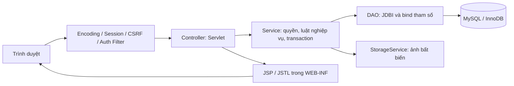

# 03 — Kiến trúc và cấu trúc mục tiêu

## Luồng xử lý



Model biểu diễn entity; DTO/form tách dữ liệu nhận từ browser và dữ liệu được phép trả về. Controller mỏng, một nhóm Servlet theo use case. Service kiểm tra quyền ngay cả khi đã có Filter: Filter kiểm tra đã đăng nhập/role, Service kiểm tra ai sở hữu tài nguyên. DAO không đọc session và không tin role từ form. Mọi SQL bind tham số JDBI sử dụng prepared statement; không ghép từ khóa/giá/ID vào SQL.

Service mở `Jdbi.inTransaction` hoặc `useTransaction`, attach các DAO vào **cùng Handle**, không cho mỗi DAO tự mở connection khi tạo/hủy đơn. Handle/pool được đóng đúng lifecycle; Servlet instance dùng chung giữa request nên không chứa state người dùng. [JDBI transaction](https://jdbi.org/releases/3.55.0/#_transactions).

## Cấu trúc sẽ tạo ở các mốc sau

Giữ Maven/WAR và package hiện có. M1 đã tạo controller/service/dao/model/config/listener/filter/security cho kiểm tra khởi động; các lớp nghiệp vụ/dto/storage dưới đây vẫn là mục tiêu của các mốc sau, không tạo skeleton không hoạt động.

```text
demo/
├── AGENTS.md
├── docs/                       # yêu cầu, thiết kế, kế hoạch, báo cáo
├── pom.xml                     # pin dependency/plugin ở M1
├── config/application.example.properties # mẫu ngoài WAR; file local được ignore
├── .mvn/wrapper/               # dùng wrapper sẵn có
└── src/
    ├── main/
    │   ├── java/com/example/demo/
    │   │   ├── controller/
    │   │   │   ├── auth/       # Register/Login/Logout/ProfileServlet
    │   │   │   ├── catalog/    # Home/Search/ProductDetailServlet
    │   │   │   ├── buyer/      # Cart/Checkout/Order/Review/ComplaintServlet
    │   │   │   ├── seller/     # Product/SalesOrder/PaymentServlet
    │   │   │   ├── admin/      # ProductModeration/Order/ComplaintServlet
    │   │   │   └── media/      # tải ảnh công khai hoặc bằng chứng có quyền
    │   │   ├── service/        # User/Product/Cart/Order/Payment/Review/ComplaintService
    │   │   ├── dao/            # UserDao, ProductDao, OrderDao... SQL Object
    │   │   ├── model/          # entity và enum trạng thái
    │   │   ├── dto/            # form, OrderDetailDto, PageResult...
    │   │   ├── filter/         # UTF-8, authentication, admin, CSRF
    │   │   ├── config/         # AppConfig, JdbiFactory, DataSourceFactory
    │   │   ├── listener/       # lifecycle ServletContextListener
    │   │   ├── storage/        # validate/ghi/đọc ảnh ngoài webroot
    │   │   ├── security/       # password hash, session, CSRF
    │   │   └── exception/      # validation, forbidden, conflict...
    │   ├── resources/
    │   │   ├── db/migration/   # V001__..., V002__... tạo ở M1 trở đi
    │   │   ├── db/schema.sql   # baseline cho schema trống
    │   │   └── db/seed.sql     # fixture demo, không reset dữ liệu thật
    │   └── webapp/
    │       ├── assets/css/, assets/js/, assets/images/
    │       ├── index.jsp      # entry/redirect trang chủ khi triển khai
    │       └── WEB-INF/
    │           ├── web.xml
    │           └── views/
    │               ├── layouts/, auth/, catalog/
    │               ├── buyer/, seller/, admin/, errors/
    └── test/
        ├── java/com/example/demo/  # Service/DAO/transaction tests
        └── resources/             # fixture test, không credential thật
```

Tên package lowercase là quy ước Java, vẫn đáp ứng các tầng Controller, Service, DAO, Model. Các lớp là dự kiến, chỉ tạo khi mốc sử dụng để tránh skeleton không hoạt động. HelloServlet được giữ tới khi thay entry ở mốc giao diện, rồi quyết định gỡ mẫu có kiểm tra.

## HTTP và màn hình dự kiến

GET không làm thay đổi dữ liệu. POST có CSRF; áp dụng Post/Redirect/Get cho thao tác thành công. Link luôn theo `request.contextPath` để chạy được cả `/demo` và `/demo_war_exploded`.

| Ngữ cảnh | GET / màn hình | POST / use case |
| --- | --- | --- |
| Công khai | `/`, `/products`, `/products/detail?id=`, `/categories` | Không có thao tác ghi công khai |
| Auth | `/register`, `/login`, `/account/profile` | Đăng ký/đăng nhập, `/logout`, cập nhật hồ sơ |
| Seller | `/seller/products`, `/seller/products/new`, `/seller/products/edit?id=` | Tạo/sửa/ẩn, cập nhật kho; ID người bán lấy từ session |
| Cart/checkout | `/cart`, `/checkout` (xem lại giá/nhận hàng) | `/cart/add`, `/cart/update`, `/cart/remove`, `/checkout` |
| Buyer orders | `/buyer/orders`, `/buyer/orders/detail?id=` | `/buyer/orders/cancel`, `/buyer/orders/receive` |
| Seller orders | `/seller/orders`, `/seller/orders/detail?id=` | `/seller/orders/confirm`, `/ship`, `/deliver`, `/cancel`, `/seller/payments/confirm` theo quyền ở 02 |
| Review | Form trong chi tiết đơn hoàn thành | `/buyer/reviews/create` |
| Buyer complaint | `/buyer/complaints`, `/buyer/complaints/detail?id=`, form theo đơn | `/buyer/complaints/create`, `/buyer/complaints/message` |
| Admin product | `/admin/products`, `/admin/products/edit?id=` | Thêm/sửa/ẩn, duyệt/từ chối, nổi bật |
| Admin order | `/admin/orders`, `/admin/orders/detail?id=` | Endpoint hành động cụ thể; không endpoint nhận state bất kỳ |
| Admin complaint | `/admin/complaints`, `/admin/complaints/detail?id=` | Nhận xử lý, phản hồi, kết luận, mở lại; admin đọc được bằng chứng |
| Media | `/media/product?id=`, `/media/order-image?id=`, `/media/evidence?id=` | Upload đi qua use case sản phẩm/khiếu nại và kiểm tra quyền |

Thông báo lỗi hiển thị tiếng Việt, không in stacktrace/SQL ra browser. 401 hoặc redirect login khi chưa đăng nhập; 403/404 khi không có quyền (thống nhất 404 cho ID tài nguyên riêng tư không thuộc mình); 409 cho hết hàng/trạng thái/phiên bản đổi; 400 cho form sai. Request lỗi phải giữ dữ liệu form hợp lệ để nhập lại.

## Cấu hình và an toàn ứng dụng

- Listener đọc `DB_URL`, `DB_USERNAME`, `DB_PASSWORD`, `UPLOAD_ROOT`, cấu hình pool từ môi trường hoặc file ngoài repository; kiểm tra thiếu cấu hình ngay khởi động. Template chỉ có placeholder. Test dùng schema/credential riêng. Không chạy migration tự động mỗi lần Servlet khởi động.
- Một DataSource pool/Jdbi cho ứng dụng; connection sử dụng UTF-8, UTC, timeout hữu hạn. `DATETIME(6)` trong DB là UTC theo quy ước; UI định dạng múi giờ Asia/Bangkok. `javax.sql.DataSource` thuộc Java SE, không phải việc trộn `javax.servlet`.
- M1 đã pin BCrypt 0.10.2, variant 2b/cost 12/salt riêng cho seed; M2 dùng PasswordHasher chung, đo work factor cho máy demo khi hoàn thiện login. Không lưu plaintext hoặc cắt mật khẩu dài âm thầm; email trim/lowercase và unique ở M2.
- Dùng HttpSession, đổi session ID khi login, invalidate khi logout; cookie HttpOnly/SameSite, Secure khi HTTPS. Kiểm tra user ACTIVE và role từ dữ liệu đáng tin khi xử lý request; role không nhận từ form đăng ký.
- Escape toàn bộ tên/mô tả/review/message bằng JSTL `c:out`; mô tả MVP là text thường. CSRF token cho login/logout và POST thay đổi; nonce chống tạo đơn lặp **khác** CSRF.
- Upload JPEG/PNG/WebP tối đa 5 MB/file, tối đa 5 ảnh/tin hoặc khiếu nại lần đầu; kiểm tra bytes/MIME thực và kích thước ảnh, tối đa 20 megapixel. File name do server tạo, cấm SVG/HTML/script và traversal, không dùng tên client làm đường dẫn.
- Storage ngoài webroot và ngoài thư mục WAR để redeploy không mất ảnh. Media endpoint kiểm tra quyền; bằng chứng không được gắn URL file public. Snapshot ảnh chỉ order buyer/seller/admin được đọc nếu ảnh gốc đã bị ẩn. Có placeholder khi asset hỏng nhưng báo admin; không âm thầm dùng ảnh mới thay snapshot cũ.
- Upload file và transaction DB không nguyên tử cùng nhau: ghi tạm/validate, tạo file bất biến, tham chiếu metadata khi transaction; rollback dọn file chưa tham chiếu. Không dọn asset đã thuộc snapshot/bằng chứng. Lượt thiết kế chưa tạo storage thật.
- Phân trang mặc định 12 sản phẩm, tối đa 50; allowlist sort NEWEST/PRICE_ASC/PRICE_DESC, danh mục/condition/price kiểm tra; keyword tối đa 100 ký tự, LIKE bind và escape ký tự wildcard nếu tìm literal. Giỏ tối đa 50 sản phẩm, quantity 1–999, giá tối đa 999.999.999.999 VND để kiểm soát input/overflow.
- Admin sửa hồ sơ nghiệp vụ cần audit trước/sau và reason; không lưu password/address/session trong JSON audit. DTO công khai không chứa email đăng nhập/password_hash.

## Phân quyền theo tài nguyên

| Tài nguyên | Buyer | Seller | Admin |
| --- | --- | --- | --- |
| Hồ sơ | Mình | Mình | Không mở thêm UI quản trị tài khoản trong MVP |
| Tin riêng/chưa duyệt | Nếu là chủ tin | `product.seller_id = currentUser.id` | Tất cả |
| Đơn/history/payment/snapshot | `order.buyer_id = currentUser.id` | `order.seller_id = currentUser.id` | Tất cả |
| Checkout batch nhiều seller | Chủ buyer, thấy tất cả đơn mình | Chỉ từng đơn mình, không lộ seller khác trong batch | Tất cả |
| Review đăng mới | Buyer và COMPLETED | Không được đánh giá thay buyer | Không được tạo thay buyer |
| Khiếu nại/bằng chứng | Buyer của order | Không truy cập bằng chứng; xem cờ có khiếu nại trên đơn mình | Tất cả |

DAO có truy vấn theo `id AND buyer_id/seller_id` khi phù hợp; Service tiếp tục kiểm tra luật trạng thái. ID liên quan từ browser (product, order_item, complaint) phải được tải và đối chiếu quan hệ, không chỉ kiểm tra role. Luật này áp dụng cả đường tải ảnh và request trực tiếp tự sửa ID.
