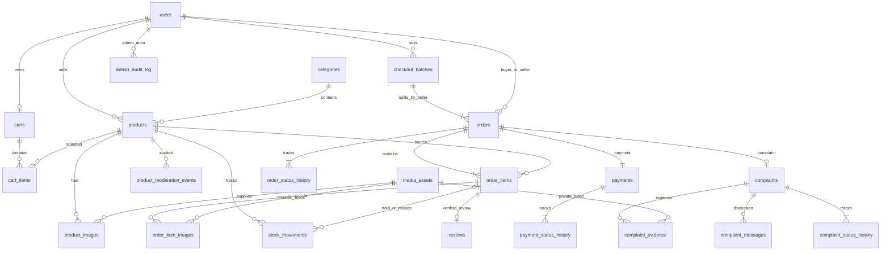
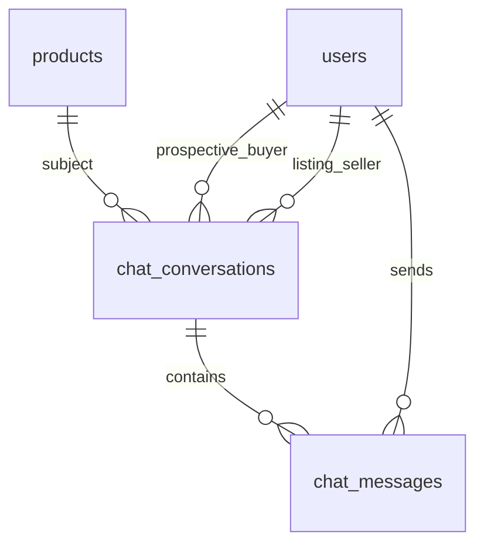

# 04 — Thiết kế database tổng thể

**V007 — QR cục bộ 06/10/2026:** tái sử dụng submissions, thêm data_source, birth_date/gender/residence/issue_date, qr_status/start và baseline sáu trường (ngày DATE). Không lưu raw QR/CMND cũ; old OCR/manual được phân loại legacy, cột/ảnh/quyết định cũ giữ nguyên. CHECK hai ảnh/sáu trường chỉ áp hồ sơ mới đã gửi, không phá hồ sơ cũ. Bản nguồn dữ liệu không phải role hoặc trạng thái duyệt; không tự chuyển APPROVED từ QR. Hiện vẫn 28 bảng nghiệp vụ. c2c_demo đã backup/áp một lần, không sửa V001–V006/schema.sql. [Định dạng/migration](15-xac-minh-nguoi-ban.md).

**V005/V006 — 06/10/2026:** thêm seller_profiles (user_id PK/FK, status NOT_SUBMITTED/PENDING/APPROVED/REJECTED, current_submission_id) và seller_verification_submissions (phiên bản riêng, consent, ảnh front/back key server, full_name/id_number, ocr_name/ocr_number/card_type/status tối thiểu, reviewer_id FK users, submitted/reviewed_at và rejection_reason). Composite FK (user_id,current_submission_id) → submissions(user_id,id) giữ đúng owner; CHECK/index hỗ trợ trạng thái/queue/đủ trường/lý do không NULL. PURGED xóa bytes và PII, giữ metadata; không cascade xóa user/giao dịch và không đánh dấu user cũ đã duyệt. Hiện **28 bảng nghiệp vụ**, 29 khi có Flyway history. c2c_demo standalone đã backup/áp V005/V006 một lần, không sửa V001–V004/schema.sql. [Migration và bảo vệ giấy tờ](15-xac-minh-nguoi-ban.md).

**Bổ sung V002 ngày 05/10/2026:** thiết kế hiện tại gồm 23 bảng nghiệp vụ, 24 bảng vật lý khi có Flyway history. V001/schema.sql vẫn là bản gốc bất biến. Thêm `vnpay_attempts` FK order: unique ref, một PENDING/đơn, amount DECIMAL, thời điểm tạo/hết hạn, gateway transaction/bank/paydate/codes/source. Payments thêm VNPAY_SANDBOX/REFUND_PENDING, history hỗ trợ actor NULL + SYSTEM chỉ cho callback. Chi tiết migration/backup ở [12 — VNPAY](12-vnpay-sandbox.md). Các mô tả 22 bảng và simulated phía dưới lưu thiết kế gốc; quyết định V002 thay phần thanh toán mới.

**Thiết kế 22 bảng đã được triển khai ở M1** trong schema.sql/V001 và kiểm tra trên MySQL 9.1.0 với datadir/schema test riêng. MySQL 8.4 LTS vẫn là mục tiêu chưa kiểm thử trực tiếp; không dùng MariaDB thay mặc định. Xem [báo cáo M1](reports/M1-nen-tang.md).

## Quy ước kiểu dữ liệu và khóa

- `id`: BIGINT UNSIGNED AUTO_INCREMENT, PK; mọi FK cùng kiểu. Mã đơn/batch public dùng UUID, unique, không dùng MAX(id)+1 và không thay thế kiểm tra quyền.
- `created_at`, `updated_at`, thời gian sự kiện: DATETIME(6), UTC do ứng dụng ghi nhất quán. History chỉ có created_at; không cập nhật/xóa sự kiện đã ghi.
- Tiền: DECIMAL(20,2), Java BigDecimal, currency CHAR(3) = VND, MVP chỉ giá nguyên đồng. Tổng tối đa giỏ 50 × quantity 999 × price 999.999.999.999 vẫn nằm trong kiểu này; kiểm tra giới hạn trước tính.
- `stock_quantity`: INT UNSIGNED, CHECK >= 0. Quantity của cart/order item INT UNSIGNED, CHECK BETWEEN 1 AND 999. Sao TINYINT UNSIGNED, CHECK BETWEEN 1 AND 5.
- Mã trạng thái VARCHAR(32) + CHECK allowlist theo tài liệu 02; không tự do nhận string từ HTTP. BOOLEAN lưu 0/1 và CHECK khi cần. Các trường bắt buộc NOT NULL; dấu `?` trong bảng là nullable; không dùng chuỗi rỗng thay NULL.
- Mọi bảng dùng InnoDB. FK mặc định ON DELETE RESTRICT / ON UPDATE RESTRICT, giữ PK bất biến. Chỉ dữ liệu giỏ tạm có thể xóa vật lý qua use case; không cascade từ user/product sang lịch sử giao dịch.
- Email lưu dạng chuẩn hóa, VARCHAR(254) unique; UUID/hash/storage key dùng collation nhị phân/ASCII để so sánh chính xác. Text tiếng Việt dùng utf8mb4. LIKE danh mục tên theo collation được nhóm thống nhất.
- `version`: BIGINT UNSIGNED để chống form cũ ghi đè. Với product tách `listing_version` (nội dung/giá/ảnh) và `stock_version` (số lượng); đặt hàng chỉ so listing_version, rồi kiểm tồn dưới khóa.

CHECK của MySQL không thay thế kiểm tra liên bảng ở Service: trạng thái đơn đủ điều kiện review, tổng tiền bằng sum(items), chủ sở hữu và ảnh thuộc sản phẩm không thể được đảm bảo chỉ bằng CHECK đơn giản. [MySQL CHECK constraints](https://dev.mysql.com/doc/refman/8.4/en/create-table-check-constraints.html).

## ERD rút gọn

ERD thể hiện quan hệ chính; các actor/reviewer/buyer/seller FK và audit target được mô tả đầy đủ bên dưới. Bội số tối thiểu một item/payment/history khi tạo đơn do Service và transaction đảm bảo, FK đơn thuần không buộc bản ghi cha có con.

## Từ điển dữ liệu — 22 bảng

### 1. users — tài khoản mua và bán

| Trường | Kiểu/ràng buộc |
| --- | --- |
| id | PK |
| email, password_hash | VARCHAR(254) UNIQUE; VARCHAR(255), chứa hash/salt theo thư viện |
| display_name, phone?, public_contact? | VARCHAR(100), VARCHAR(30), VARCHAR(255); phone riêng, contact công khai tự chọn |
| role, status | USER/ADMIN; ACTIVE/INACTIVE |
| created_at, updated_at | Thời gian |

Không xóa user đã tham gia giao dịch. Đổi hồ sơ không đổi thông tin giao hàng/seller snapshot của đơn cũ. Không lưu password plain, không lưu BUYER/SELLER thành role.

M2 dùng nguyên bảng này, không sửa V001 hoặc cần ALTER. Đăng ký normalize email và insert USER/ACTIVE với BCrypt; UNIQUE uq_users_email bảo vệ race. Hồ sơ chỉ update display_name/phone/public_contact/updated_at, khóa hàng theo ID session trong transaction và kiểm ACTIVE; email/role/status/password_hash không nhận từ form hồ sơ.

### 2. categories — danh mục một cấp

`id` PK; `name` VARCHAR(100); `slug` VARCHAR(120) UNIQUE; `status` ACTIVE/INACTIVE; `sort_order` INT mặc định 0; created_at/updated_at. FK từ product. Không thêm parent_id chưa cần thiết; nếu phát triển danh mục nhiều cấp phải migration riêng. Ngừng danh mục không xóa sản phẩm/đơn cũ.

### 3. media_assets — metadata của file ảnh bất biến

`id` PK; `uploaded_by` FK users; `storage_key` VARCHAR(255) UNIQUE (khóa tương đối do server sinh, không chứa URL tạm); `original_name` VARCHAR(255) chỉ metadata; `mime_type` VARCHAR(64); `byte_size` BIGINT UNSIGNED > 0; `sha256` CHAR(64); `width`, `height` INT UNSIGNED > 0; `purpose` PRODUCT_IMAGE/COMPLAINT_EVIDENCE; `created_at`.

Không update bytes trên cùng storage_key. Không xóa asset được order_item_images/complaint_evidence tham chiếu. SHA-256 để đối chiếu toàn vẹn, **không** tự cho người dùng dùng chung quyền truy cập bằng hash. Không lưu blob ảnh trực tiếp trong bảng.

### 4. products — tin đăng hiện tại

| Trường | Kiểu/ràng buộc |
| --- | --- |
| id | PK |
| seller_id, category_id | FK users/categories, NOT NULL; seller bất biến |
| title, description | VARCHAR(200); TEXT (Service giới hạn 10.000 ký tự) |
| price, currency | DECIMAL(20,2), CHECK > 0; VND |
| condition_code | NEW/LIKE_NEW/USED |
| stock_quantity | INT UNSIGNED khả dụng >= 0; initial nhập bởi seller |
| visibility, moderation_status | PUBLIC/HIDDEN; PENDING/APPROVED/REJECTED |
| is_featured | BOOLEAN, mặc định false |
| listing_version, stock_version | BIGINT UNSIGNED, mặc định 1 |
| created_at, updated_at | Thời gian |

Không lưu sold_flag riêng. Admin sửa thay seller được audit; không sửa seller_id để chuyển đơn sang người khác. Tin được truy cập/mua theo điều kiện ở 02.

### 5. product_images — thứ tự ảnh tin hiện tại

`id` PK; `product_id` FK products; `asset_id` FK media_assets; `sort_order` INT UNSIGNED >= 0; `alt_text?` VARCHAR(255); created_at. UNIQUE(product_id, sort_order), UNIQUE(product_id, asset_id); vị trí 0 là ảnh đại diện, 0–5 ảnh/tin do Service kiểm tra. Tin thiếu ảnh dùng ảnh mặc định theo yêu cầu triển khai M3–M6.

Sửa tin có thể gỡ quan hệ product_images; không xóa asset vì ảnh có thể còn trong đơn cũ. Asset phải purpose PRODUCT_IMAGE và người upload có quyền đối với tin.

### 6. product_moderation_events — lịch sử kiểm duyệt

`id` PK; `product_id` FK products; `actor_id` FK users; `from_status?`, `to_status` theo PENDING/APPROVED/REJECTED; `reason?` TEXT; `listing_version` BIGINT UNSIGNED; `created_at`. Tạo/đổi nội dung ghi PENDING; admin duyệt/từ chối ghi chuyển; từ chối bắt buộc lý do. Actor không nhất thiết admin khi tự gửi duyệt lại, nhưng chỉ admin duyệt/từ chối. Ghi sự kiện và trạng thái cùng transaction.

### 7. carts — một giỏ/tài khoản

`id` PK; `user_id` FK users UNIQUE; `version` BIGINT UNSIGNED; created_at/updated_at. Khóa bản ghi giỏ để serialize thao tác giỏ/checkout của cùng người. Không lưu tổng tiền cố định.

### 8. cart_items — sản phẩm đã chọn

`id` PK; `cart_id` FK carts; `product_id` FK products; `quantity` 1–999; created_at/updated_at. UNIQUE(cart_id, product_id). Có thể xóa item sau checkout hoặc remove. Thêm vào giỏ không giữ kho; giỏ không lưu giá làm nguồn thanh toán. Tin bị ẩn/hết hàng vẫn có thể hiện cảnh báo trong giỏ và chặn checkout.

### 9. checkout_batches — nhóm đơn và chống tạo lặp

`id` PK; `batch_code` CHAR(36) UNIQUE; `buyer_id` FK users; `idempotency_key` CHAR(36); `request_hash` CHAR(64); `created_at`. UNIQUE(buyer_id, idempotency_key); UNIQUE(id, buyer_id) làm đích FK ghép của orders.

Chỉ tồn tại batch đã commit; không cần status riêng ở MVP. Hash payload chuẩn hóa (cart version, product/quantity/listing_version đã xem, phương thức, người nhận); không lưu secret/token. Cùng key/cùng payload trả lại các đơn cũ; cùng key/khác payload từ chối 409. Key không được dùng làm quyền xem batch.

### 10. orders — một đơn/một người bán

| Trường | Kiểu/ràng buộc |
| --- | --- |
| id, order_code | PK; CHAR(36) UNIQUE |
| checkout_batch_id, buyer_id, seller_id | FK batches/users/users; FK ghép (checkout_batch_id,buyer_id) → batches(id,buyer_id) |
| status, currency | PENDING/CONFIRMED/SHIPPED/DELIVERED/COMPLETED/CANCELLED; VND |
| recipient_name, recipient_phone, shipping_address | VARCHAR(100), VARCHAR(30), VARCHAR(500); bản chụp bắt buộc |
| buyer_name_snapshot, seller_name_snapshot, seller_contact_snapshot? | VARCHAR(100), VARCHAR(100), VARCHAR(255) |
| subtotal, shipping_fee, grand_total | DECIMAL(20,2), >= 0; shipping_fee mặc định 0; CHECK grand_total = subtotal + shipping_fee |
| version | BIGINT UNSIGNED |
| completed_at?, cancelled_at? | DATETIME(6); Service đảm bảo phù hợp status |
| created_at, updated_at | Thời gian |

UNIQUE(checkout_batch_id, seller_id), CHECK buyer_id <> seller_id. `subtotal = SUM(order_items.line_total)` do Service đảm bảo. UNIQUE(id,buyer_id) để FK review/complaint. Địa chỉ/snapshot/total không sửa sau tạo. Danh sách theo seller không trả thông tin các order khác trong batch.

### 11. order_items — bản chụp sản phẩm tại thời điểm đặt

`id` PK; `order_id` FK orders; `product_id` FK products RESTRICT; `product_listing_version` BIGINT UNSIGNED; `product_name_snapshot` VARCHAR(200); `description_snapshot` TEXT; `condition_snapshot` theo condition; `category_name_snapshot` VARCHAR(100); `unit_price` DECIMAL(20,2) > 0; `quantity` 1–999; `line_total` DECIMAL(20,2), CHECK line_total = unit_price × quantity; `created_at`.

UNIQUE(order_id, product_id) (giỏ được gộp product nên mỗi product chỉ một dòng/đơn); UNIQUE(id,order_id) để FK ghép. Service đảm bảo product.seller_id = order.seller_id. Thông tin không cập nhật từ product; không cho admin sửa snapshot.

### 12. order_item_images — tất cả ảnh lúc đặt

`id` PK; `order_item_id` FK order_items; `asset_id` FK media_assets RESTRICT; `sort_order` INT UNSIGNED; `alt_text_snapshot?` VARCHAR(255); `created_at`. UNIQUE(order_item_id,sort_order), UNIQUE(order_item_id,asset_id). Đọc từ asset bất biến nên sửa/gỡ ảnh tin sau đó không đổi bằng chứng đơn. Không tham chiếu product_images vì quan hệ ảnh hiện tại có thể bị gỡ.

### 13. order_status_history — lịch sử đơn

`id` PK; `order_id` FK orders; `from_status?`, `to_status` theo order.status; `actor_id` FK users NOT NULL; `actor_role_snapshot` USER/ADMIN; `reason?` TEXT; `created_at`. Dòng ban đầu NULL → PENDING do buyer, các dòng sau phải tương ứng transition được phép. Status hiện tại và history cùng transaction. Sắp xếp created_at,id; không xóa/sửa dòng cũ.

### 14. payments — một thanh toán mô phỏng/đơn

`id` PK; `order_id` FK orders UNIQUE; `method` COD/BANK_TRANSFER_SIMULATED; `status` UNPAID/PENDING_CONFIRMATION/PAID/VOIDED/REFUND_SIMULATED; `amount` DECIMAL(20,2) > 0; `currency` VND; `is_simulated` BOOLEAN CHECK = true; `reference_code` CHAR(36) UNIQUE do server sinh; `paid_at?`, `refunded_at?`; created_at/updated_at.

Service kiểm amount = orders.grand_total, method/status hợp lệ; không lưu thông tin thẻ/tài khoản ngân hàng thật. Không cho chỉnh amount/method sau tạo. paid_at giữ khi refund mô phỏng để biết đã thanh toán trước đó.

### 15. payment_status_history — lịch sử thanh toán

`id` PK; `payment_id` FK payments; `from_status?`, `to_status`; `actor_id` FK users; `actor_role_snapshot` USER/ADMIN; `note?` TEXT; `created_at`. Lưu cả dòng khởi tạo. Thu COD tự động lúc DELIVERED ghi actor là seller/admin yêu cầu giao, note “Service ghi nhận thu COD mô phỏng”. Không thêm actor SYSTEM nếu chưa có job nền.

### 16. stock_movements — sổ biến động khả dụng

`id` PK; `product_id` FK products; `order_item_id?` FK order_items; `movement_type` INITIAL/ADJUSTMENT/ORDER_HOLD/CANCEL_RELEASE; `quantity_delta` BIGINT có dấu; `quantity_before`, `quantity_after` INT UNSIGNED >= 0; `actor_id` FK users; `reason?` TEXT; created_at. BIGINT có dấu cho delta tránh tràn khi điều chỉnh toàn miền INT UNSIGNED của tồn khả dụng.

CHECK quantity_after = quantity_before + quantity_delta; INITIAL >= 0, ADJUSTMENT khác 0, HOLD < 0, RELEASE > 0. UNIQUE(order_item_id,movement_type) ngăn hold/release lần hai; MySQL cho nhiều NULL để nhiều ADJUSTMENT không gắn item. CHECK loại HOLD/RELEASE bắt buộc có order_item_id, INITIAL/ADJUSTMENT bắt buộc NULL; đối chiếu product_id và abs(delta)=item.quantity ở Service. Một INITIAL/tin do Service tạo cùng tin; initial 0 vẫn lưu để truy vết. Seller/admin điều chỉnh stock chỉ phần **khả dụng**, reason bắt buộc, cập nhật stock_version. Không sửa nhật ký để “sửa kho”.

### 17. reviews — đánh giá xác thực theo dòng đơn

`id` PK; `order_item_id` FK order_items UNIQUE; `order_id` FK orders; `buyer_id` FK users; `product_rating`, `seller_rating` sao 1–5; `comment` VARCHAR(2000); `visibility` VISIBLE/HIDDEN; `hidden_reason?` VARCHAR(500); `hidden_by?` FK users; `hidden_at?`; `created_at`.

FK ghép (order_item_id,order_id) → items(id,order_id) và (order_id,buyer_id) → orders(id,buyer_id) đảm bảo đúng đơn/buyer. Service vẫn kiểm user đang gọi và status COMPLETED trong transaction. Product và seller suy ra từ item/order, tránh cột ID dư bị lệch. Nhãn mua qua hệ thống không lưu boolean có thể sửa. Việc admin ẩn review được audit; không mất review cũ.

### 18. complaints — hồ sơ phản ánh theo đơn

`id` PK; `order_id` FK orders UNIQUE; `buyer_id` FK users; `order_item_id?` FK items; `reason_code` NOT_AS_DESCRIBED/DAMAGED/NOT_RECEIVED/PAYMENT/OTHER; `title` VARCHAR(200); `content` TEXT (tối đa 5.000 ký tự); `status` RECEIVED/PROCESSING/RESOLVED; `assigned_admin_id?` FK users; `resolution_code?` SELLER_CONTACTED/ORDER_CANCELLED/NO_ACTION/OTHER; `resolution_summary?` TEXT; `resolved_at?`; created_at/updated_at.

FK ghép (order_id,buyer_id) → orders(id,buyer_id), (order_item_id,order_id) → items(id,order_id). Item NULL nghĩa toàn đơn. User được chỉ định xử lý phải ADMIN ở Service. RESOLVED bắt buộc resolution/summary/time, mở lại đặt các trường kết luận hiện tại về NULL nhưng không mất kết luận trước vì đã lưu history/messages. Một hồ sơ/order giúp chặn duplicate nhưng có nhiều bổ sung.

### 19. complaint_evidence — ảnh minh chứng riêng tư

`id` PK; `complaint_id` FK complaints; `asset_id` FK media_assets RESTRICT; `uploaded_by` FK users; `caption?` VARCHAR(255); `created_at`. UNIQUE(complaint_id,asset_id). Asset phải purpose COMPLAINT_EVIDENCE; uploader là buyer hồ sơ trong MVP. Tối đa 5 ảnh/lần gửi và 20 ảnh tổng/hồ sơ. Bằng chứng không sửa/xóa từ UI; quyền tải theo complaint, không chỉ theo asset id.

### 20. complaint_messages — nội dung phản hồi/bổ sung

`id` PK; `complaint_id` FK complaints; `author_id` FK users; `author_role_snapshot` USER/ADMIN; `message_type` BUYER_MESSAGE/ADMIN_RESPONSE/RESOLUTION/REOPEN; `body` TEXT tối đa 5.000 ký tự; `created_at`. Khởi tạo dùng complaint.content; admin phản hồi nhiều lần, buyer bổ sung khi mở. Kết luận/mở lại lưu ở đây và history cùng transaction; không sửa message cũ.

### 21. complaint_status_history — tiến độ xử lý

`id` PK; `complaint_id` FK complaints; `from_status?`, `to_status`; `actor_id` FK users; `reason?` TEXT; `resolution_code_snapshot?`, `resolution_summary_snapshot?` TEXT; `created_at`. NULL → RECEIVED là buyer; các chuyển còn lại là admin. Kết luận lưu snapshot để mở lại không mất kết quả lần trước; cập nhật status hiện tại cùng transaction.

### 22. admin_audit_log — quản trị ngoài các history chuyên biệt

`id` PK; `actor_id` FK users; `action` VARCHAR(64); `product_id?` FK products; `order_id?` FK orders; `complaint_id?` FK complaints; `review_id?` FK reviews; `reason` VARCHAR(1000); `before_data?`, `after_data?` JSON; `created_at`. CHECK đúng một target FK khác NULL. Actor phải ADMIN ở Service; không audit password/session/địa chỉ nhận hàng. Product edit/hide/feature, review hide và can thiệp quản trị có audit; history chuyên biệt vẫn là nguồn trạng thái, audit không thay thế history.

## Index và ràng buộc liên quan

| Bảng | Index bổ sung theo truy vấn |
| --- | --- |
| products | (seller_id,updated_at,id), (visibility,moderation_status,created_at,id), (category_id,visibility,moderation_status,price,id), (is_featured,visibility,moderation_status,created_at,id) |
| order_items | (product_id,order_id); FK/unique theo từ điển |
| orders | (buyer_id,created_at,id), (seller_id,status,created_at,id), (status,created_at,id) |
| histories/events | (parent_id,created_at,id); moderation thêm (product_id,listing_version) |
| stock_movements | (product_id,created_at,id); unique(item,type) |
| complaints | (status,created_at,id), (buyer_id,created_at,id), (assigned_admin_id,status,created_at,id) |
| messages/evidence | (complaint_id,created_at,id) |
| admin_audit_log | (actor_id,created_at,id); index từng target FK |

Không hứa index B-tree tối ưu LIKE `%keyword%`; dữ liệu đồ án nhỏ dùng LIKE bind/phân trang. FULLTEXT là cải tiến sau đo đạc, không bắt buộc MVP. Điểm trung bình truy vấn join reviews VISIBLE → item/product hoặc order/seller; chỉ các đơn COMPLETED. Không lưu cache điểm độc lập khi chưa có cơ chế cập nhật nhất quán.

## Snapshot và giữ ảnh

Ví dụ tin A có tên “Tai nghe”, giá 200.000, USED, mô tả M1, ảnh asset 10/11. Khi tạo đơn, order_item chụp các trường và order_item_images tham chiếu 10/11. Seller sửa thành giá 250.000/mô tả M2/ảnh 12: tin dùng dữ liệu mới, đơn vẫn 200.000/M1/10/11. Seller/contact và người nhận cũng được chụp, không join hồ sơ hiện tại để thay thông tin lịch sử.

Tham chiếu asset **chỉ đủ khi bytes bất biến và không bị xóa**. Chưa cần nhân đôi file vật lý vì dùng content bất biến + FK RESTRICT + storage retention. Nếu di chuyển storage, giữ mapping storage_key và hash; không dùng URL ảnh CDN có hạn hoặc URL ảnh seller có thể ghi đè. Ẩn tin không ẩn snapshot đối với bên tham gia đơn/admin.

## Transaction tạo đơn nhiều người bán

Luồng đã triển khai tại M3–M6 (không thay đổi V001):

1. Kiểm session ACTIVE, CSRF, idempotency key, form nhận hàng/phương thức. Chuẩn hóa/hash payload; nếu batch cùng buyer/key đã commit, kiểm hash rồi trả kết quả cũ, không đọc lại giỏ đã rỗng.
2. Mở transaction trên một Handle, khóa tài khoản actor ACTIVE rồi kiểm batch cùng buyer/key. Khóa carts của buyer; mọi add/update/remove cũng khóa actor/cart theo cùng thứ tự. Khóa actor làm hai request của cùng buyer tuần tự, bao gồm retry key.
3. Đọc items của giỏ; khóa products theo **ID tăng dần** rồi đọc lại dữ liệu join seller/category ở READ COMMITTED. Sau khóa kiểm buyer != seller, PUBLIC/APPROVED, seller/category ACTIVE, listing_version khớp bản xem lại, quantity đủ. Sửa ảnh/nội dung tin cũng khóa product trước để snapshot không trộn hai phiên bản. Chưa có chức năng khóa seller/category; mốc triển khai chức năng này phải đồng bộ khóa với checkout.
4. Tính subtotal theo giá DB đang khóa. Nếu listing_version/cart version khác trang checkout, rollback và yêu cầu xem lại, không âm thầm dùng tổng cũ.
5. Nhóm theo seller; tạo batch và mỗi seller một order, tất cả item/snapshot ảnh, payment, order/payment history ban đầu. Kiểm tồn sau SELECT FOR UPDATE rồi cập nhật trên cùng Handle/transaction; thêm ORDER_HOLD, tăng stock_version. Khóa được giữ đến commit/rollback, không có khoảng trống giữa đọc và ghi.
6. Xóa các cart_items đã đặt, tăng cart.version; commit toàn bộ. Nếu một item lỗi/insert lỗi thì rollback đơn, kho, batch, payment, giỏ và history. Không có đơn của seller A tồn tại khi seller B thất bại trong cùng checkout.
7. Redirect kết quả batch cho buyer. Bản demo chưa tự retry deadlock; lỗi DB rollback và báo không khả dụng. Người dùng gửi lại cùng key/nội dung được kết quả đã commit hoặc thực hiện transaction mới nếu chưa commit; không retry riêng câu trừ kho.

Khóa InnoDB phải nằm trong transaction, đọc tồn trước rồi trừ ở connection khác là không đủ. [MySQL locking reads](https://dev.mysql.com/doc/refman/8.4/en/innodb-locking-reads.html). Isolation đề xuất READ COMMITTED; không dùng SKIP LOCKED vì có thể bỏ mất sản phẩm của giỏ. Thứ tự khóa và rollback/retry cần test trên engine thật.

## Transaction hủy, chuyển trạng thái và khiếu nại

- Hủy: khóa order, kiểm ownership và trạng thái; nếu đã CANCELLED thì trả trạng thái hiện tại, không release lần nữa. Khóa product ID tăng dần; payment và các bản ghi liên quan cùng Handle. Với mỗi item, cộng lại quantity, ghi CANCEL_RELEASE (unique item/type), tăng stock_version. Đổi order CANCELLED, payment VOIDED hoặc REFUND_SIMULATED, timestamps và histories/audit; commit. Một lỗi phải rollback toàn bộ.
- Không hoàn kho từ SHIPPED/DELIVERED/COMPLETED. Không giảm kho ở CONFIRMED/SHIPPED vì đã trừ khả dụng lúc tạo. Thất bại tạo đơn rollback tự khôi phục, không ghi CANCEL_RELEASE cho đơn chưa tồn tại.
- Khi seller đặt “đã bán”/đổi khả dụng: khóa product, so stock_version từ form, cập nhật phần khả dụng và ADJUSTMENT; không chỉnh lượng đã nằm trong order. Hủy sau đó hoàn quantity về khả dụng, nhưng tin HIDDEN/REJECTED vẫn không mua được; muốn ngừng bán thì dùng HIDDEN.
- Chuyển trạng thái khác: khóa order, kiểm transition rồi cập nhật/history; DELIVERED COD đổi payment/history cùng transaction. Không tin version/status client làm nguồn hiện tại.
- Tạo/giải quyết khiếu nại và xác nhận nhận/review đều khóa **order trước**. Tạo complaint + history/evidence/message cùng transaction, kiểm item/buyer theo FK ghép. COMPLETED phải đọc kiểm complaint đang mở dưới cùng khóa order để tránh đua tạo complaint/nhận hàng.
- Review: khóa order, kiểm COMPLETED/current buyer, insert review; UNIQUE(order_item_id) chặn hai tab gửi đồng thời. Complaint sau COMPLETED vẫn được tiếp nhận và review cũ được giữ.
- Thứ tự tại demo: actor → cart → product IDs tăng dần khi checkout; actor → order → payment → product IDs tăng dần khi hủy. Checkout tạo order/payment mới nên không chờ khóa order/payment có sẵn. Sửa tin khóa actor → product → ảnh. M7/M8 phải thống nhất actor → order → payment/complaint và tránh khóa ngược. Đã kiểm hai checkout cạnh tranh tồn cuối; chưa stress deadlock phối hợp mọi thao tác.

Stock khả dụng sau hold = trước − quantity, sau cancel = khả dụng hiện tại + quantity. Đây là mô hình đơn giản cho đồ án; chưa quản lý tồn vật lý/đang vận chuyển bằng nhiều ledger riêng, chưa có timeout/job tự động và không tự bù kho khi hàng hỏng.

## Migration và dữ liệu hiện có

Chưa thấy schema trong repository, không kết luận DB máy trống. M1 phải có hostname/port/schema/user/credential và xác minh bằng `SELECT VERSION()`, engine/charset/sql_mode; khảo sát bảng/FK/count theo quyền cho phép. Không dò mật khẩu WAMP hay dùng root không mật khẩu làm mặc định.

Nếu DB mới: tạo schema demo/test riêng khi triển khai được yêu cầu, viết V001 cho các bảng theo phụ thuộc users/categories/media → products/carts/batches → orders/items → histories/payments/stock/reviews/complaints → evidence/messages/audit; seed dữ liệu giả có kiểm soát.

Nếu có DB cũ: lưu schema dump và backup dữ liệu, lập mapping trường cũ, migration tăng dần (add nullable → backfill → kiểm tra duplicate/orphan/giá/tồn → unique/NOT NULL/FK), thử trên bản sao trước. Không DROP/TRUNCATE/reset DB. Snapshot lịch sử không thể suy lại chính xác từ tin đã thay đổi: đánh dấu dữ liệu legacy cần xác minh trong migration riêng, không gắn nhãn “đã mua qua hệ thống” cho giao dịch không có nguồn đáng tin. Không hạ cấp MySQL 9.1 đang có xuống 8.4 tại chỗ.

DDL cụ thể ở `src/main/resources/db/schema.sql`, migration V001 tương đương tại M1; Flyway dùng thêm bảng hạ tầng `flyway_schema_history` nên 23 bảng vật lý, 22 bảng nghiệp vụ. Migrate/seed chỉ chạy từ DatabaseTool, không tự chạy lúc deploy. Không auto baseline/clean/reset DB có sẵn.

## Quyết định bổ sung tại M1

- Ràng buộc CHECK đã bổ sung kiểm thời gian terminal của order/payment, thông tin review ẩn và complaint resolved để tránh bản ghi thiếu trường bắt buộc. Luật transition/ownership/role liên bảng vẫn phải do Service ở mốc sau xử lý.
- Delta kho BIGINT signed, cân bằng sử dụng CAST lượng unsigned về signed; tránh phép cộng unsigned với delta âm. FK composite order/buyer và item/order đúng thiết kế. 46 FK và 52 CHECK đã có trên engine test.
- Timestamps mặc định CURRENT_TIMESTAMP(6) ở schema; kết nối JDBI/session SQL đặt UTC. updated_at do Service cập nhật khi thay đổi, không tự đổi khi seed no-op.
- Seed có 5 tài khoản BCrypt 2b/cost 12/salt riêng và 4 sản phẩm, giữ HIDDEN/PENDING vì chưa có ảnh thật. Không tạo metadata ảnh trỏ file không tồn tại hoặc duyệt tin thiếu ảnh; bổ sung ở M3.
- Không viết ALTER cho schema legacy chưa được cung cấp. Schema có bảng chưa có Flyway history bị từ chối; cần khảo sát/backup/mapping và migration riêng, không tự baseline hay drop.

## Quyết định bổ sung tại M3–M6

Không cần thêm bảng/cột hoặc migration: 22 bảng V001 đủ cho mua bán. Không sửa schema.sql, seed.sql hay V001 đã áp. Quy tắc ảnh mặc định thay yêu cầu “tin phải có ảnh” ở thiết kế M1; seed cũ vẫn HIDDEN/PENDING, Admin chủ động sửa PUBLIC rồi duyệt khi demo. Không tự công khai dữ liệu cũ khi deploy.

Ghi chú checkout lưu history khởi tạo; snapshot và thông tin giao nhận chỉ đọc trên đơn. Chuyển khoản mô phỏng cho phép buyer của đơn bấm PAY theo yêu cầu mới, không thêm trạng thái. MediaServlet xác minh quyền theo asset + order khi tải snapshot; URL ảnh sản phẩm chỉ tải ảnh hiện tại khi tin công khai, hoặc chủ tin/Admin.

## Quyết định bổ sung tại M7–M8

Đã khảo sát **read-only SHOW CREATE TABLE** trên c2c_demo/MySQL 9.1.0 cho reviews, complaints, complaint_evidence, complaint_messages, complaint_status_history và media_assets; cấu trúc khớp V001, có UNIQUE/FK/CHECK cần thiết. Không thay đổi schema hoặc dữ liệu ứng dụng, không cần migration mới và không sửa V001/schema.sql/seed.sql.

Form M7 có một số sao chung; `product_rating` và `seller_rating` cùng giá trị, UI sản phẩm dùng product_rating. Product/seller liên kết qua order_items/orders; nhãn mua xác thực do join đúng đơn COMPLETED quyết định. Chỉ VISIBLE tính trung bình; danh sách hiển thị tối đa 100 review mới nhất, summary tính toàn bộ review hợp lệ.

Form M8 phản ánh cả đơn (`order_item_id=NULL`), lý do 4 lựa chọn, title suy ra phía server. Nội dung/phản hồi theo giới hạn 5.000 ký tự đã thiết kế. UNIQUE(order_id) giữ một hồ sơ mãi mãi; gửi lại trả ID cũ. Khi mở lại, cột kết luận hiện tại về NULL để thỏa CHECK, kết quả cũ vẫn trong history/messages. assigned_admin_id lưu Admin xử lý, resolved_at lưu thời điểm; các messages/history lưu actor và thời điểm.

ComplaintService khóa actor → order → complaint; COMPLETE cũng khóa actor → order trước kiểm RECEIVED/PROCESSING. Không thay payment/order khi đóng hồ sơ; kết quả ORDER_CANCELLED chỉ chấp nhận nếu đơn thực sự CANCELLED. Media evidence chỉ đọc sau kiểm buyer/Admin, luôn kiểm quan hệ asset/complaint/purpose. Không đưa ảnh evidence vào product_images hoặc order_item_images.

## Mở rộng chat trước khi mua — V003, 05/10/2026

Baseline 22 bảng và V002 vnpay_attempts giữ nguyên. Không có bảng chat thương mại trước lượt này; complaint_messages giữ use case khiếu nại. V003 thêm hai bảng, tổng 25 bảng nghiệp vụ; Flyway history là bảng công cụ thứ 26 ở schema do Flyway quản lý.

### chat_conversations

id BIGINT UNSIGNED PK; product_id FK products; buyer_id/seller_id FK users, CHECK khác nhau, UNIQUE(product_id,buyer_id,seller_id). Seller suy ra từ sản phẩm, khóa actor → product khi bắt đầu; không lấy seller từ request. product_title_snapshot VARCHAR(200) giữ tên ban đầu khi tin mất quyền public; không lưu lại credential/contact trong chat.

buyer_read_id/seller_read_id BIGINT UNSIGNED mặc định 0 là cursor đã đọc, không phải FK vì 0 biểu thị chưa đọc và tránh vòng FK với messages. Service kiểm through ID thuộc conversation và chỉ tăng GREATEST. created_at/updated_at DATETIME(6) UTC. updated_at chỉ tăng khi gửi tin, không khi đọc để không đảo hộp thư sai. Index buyer/time/id và seller/time/id.

### chat_messages

id BIGINT UNSIGNED PK; conversation_id FK conversations, sender_id FK users. body VARCHAR(2000), utf8mb4, CHECK độ dài; Service trim/kiểm 1–2.000 Unicode code points/NUL. client_nonce ASCII CHAR(36) UUID, UNIQUE(conversation_id,sender_id,client_nonce) để retry không nhân tin. created_at DATETIME(6) UTC. Index conversation/id cho phân trang, conversation/sender/id cho unread. Không cascade delete và chưa có UI xóa/sửa.

Quyền participant và ACTIVE được kiểm lại ở Service cho mọi đọc/ghi, DAO còn lọc participant trong truy vấn metadata/lock. Transaction send/read khóa actor → conversation; các DAO cùng Handle, không giữ Handle qua request. Cùng conversation khóa nối tiếp việc cấp ID/lưu tin và cập nhật cursor; rollback lỗi giữ nguyên tin/cursor. Không khóa đối tác ngược chiều để tránh hai người trả lời bị deadlock. Chỉ tin từ người kia có id > read cursor mới tính chưa đọc.

Đã thử V001/V002/V003 trên c2c_chat_test/MySQL 9.1.0 InnoDB và chạy lại migrate trả 0. Trên c2c_demo, khảo sát xác nhận standalone V002 không history/không chat; backup .local-test/c2c-demo-before-chat-20261005.sql, áp V003 một lần, đối chiếu fingerprint dữ liệu của cả 23 bảng cũ không đổi. Hai bảng mới trống, không seed hoặc thử ghi chat vào database ứng dụng. [Báo cáo](reports/Chat-mua-ban.md).

## V004 — Ảnh đánh giá và khai báo hàng cũ (05/10/2026)

26 bảng nghiệp vụ, thêm review_images(id,review_id FK reviews,asset_id FK media_assets,sort_order0..2,created_at). UNIQUE(review_id,sort_order), UNIQUE(review_id,asset_id), indexasset và CHECK sort; không xóa cascade. Media purpose thêm REVIEW_IMAGE, không mở quyền đọc evidence.

Products thêm appearance_code/operation_code/repair_code VARCHAR24 với CHECK allowlist/NOT_APPLICABLE, known_defects/repair_details/accessories VARCHAR1000, tất cả NULL cho bản ghi cũ. Order_items thêm sáu trường *_snapshot tương ứng; checkout chép từ tin đang khóa, không cập nhật snapshot sau đó. Product_images.is_defect và order_item_images.is_defect_snapshot BOOLEAN default false/CHECK 0–1; bytes ảnh vẫn bất biến theo storage hiện tại. Không sửa V001–V003/schema baseline.

Đã khảo sát SHOW CREATE sáu bảng, full backup và fingerprints từng cột cũ/rowcounts cho 25 bảng c2c_demo standalone V003. Sau rehearsal trên c2c_upgrades_test, áp V004 một lần; tất cả dữ liệu cột cũ giữ nguyên, review_images trống. Không fixture write DB ứng dụng. Backup ignored `.local-test/c2c-demo-before-upgrades-20261005.sql`. DDL implicit commit, không SOURCE lại toàn script nếu áp dở; khảo sát bổ sung từng phần. [Hướng dẫn](14-demo-bon-nang-cap.md).
