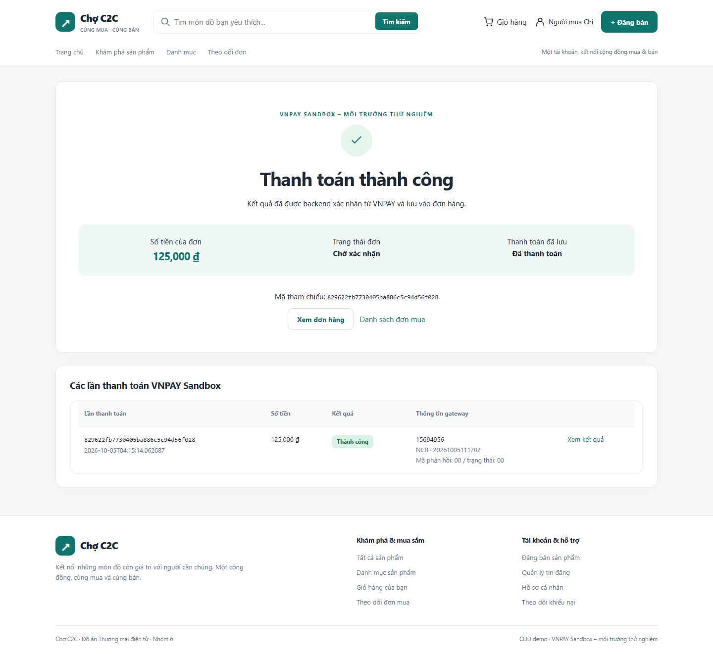
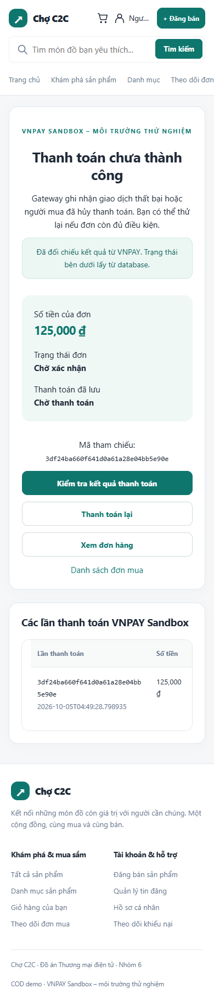

# Bàn giao VNPAY Sandbox — 05/10/2026

## Kết quả

Đã triển khai checkout COD/VNPAY Sandbox theo từng đơn, URL pay 2.1.0 HMACSHA512, Return chỉ đọc, IPN checksum + JSON ACK, querydr backend cho localhost, attempt/retry và REFUND_PENDING. Giữ các giao dịch chuyển khoản mô phỏng cũ. Không có API hoàn tiền/production, không đổi framework.

**Đã thực hiện một thanh toán NCB Sandbox thật qua browser headless và xác nhận bằng querydr có chữ ký:** amount 125.000 VND, gateway transaction **15694956**, bank NCB, ResponseCode00 / TransactionStatus00, attempt SUCCEEDED/QUERYDR, payment PAID, order vẫn PENDING. Đây là dữ liệu fixture `c2c_vnpay_test` trên instance riêng13316, không phải đơn của database ứng dụng. Return trước query đúng trạng thái đang xác nhận; không lấy PAID từ URL.

**Đã thực hiện hủy tại gateway và querydr xác nhận:** TransactionStatus11, attempt FAILED, payment PENDING_CONFIRMATION; browser hiển thị thất bại và bấm Thanh toán lại mở Sandbox với ref mới. Database của đơn có 2 attempts và chỉ 1 ORDER_HOLD. Cũng đã thử thẻ NCB không đủ số dư, gateway hiển thị lỗi số dư; kết quả hủy sau đó đã giúp phát hiện mã11. Đã bổ sung mapping11 (hủy) và08 (hết thời gian) theo Techspec chính thức mục2.5.7.2 trang36, không suy diễn từ mã API00.

**IPN gọi từ VNPAY qua địa chỉ public chưa kiểm thử.** Endpoint localhost đã kiểm bằng HTTP; xác nhận thực tế dùng querydr. Cần cấu hình/đăng ký IPN public với bên cấp merchant nếu muốn demo server-to-server.

## File tạo/sửa

Các đường dẫn dưới tính từ gốc repository.

| Nhóm | File | Mục đích |
| --- | --- | --- |
| Config | `config/application.example.properties`, `config/VnpayConfig.java`, `config/AppConfig.java`, `config/ShopServices.java`, `listener/ApplicationListener.java` | Backend optional Sandbox, env/file, không lộ secret, khởi tạo Service chung |
| Gateway | `payment/VnpayProtocol.java`, `payment/VnpayGateway.java`, `payment/VnpayHttpClient.java`, `model/VnpayAcknowledgement.java` | Ký URL/pipe querydr, HTTP HTTPS timeout, JSON parse chống duplicate field, ACK |
| Nghiệp vụ | `service/VnpayService.java`, `dao/VnpayDao.java`, `service/OrderService.java`, `dao/OrderDao.java` | Ownership/amount, transaction chung, retry, late result, hủy cần hoàn, giữ kho |
| HTTP | `controller/payment/VnpayServlet.java`, `filter/AccessFilter.java` | Create/query POST CSRF; Return/result buyer; exact IPN GET miễn session |
| Migration | `src/main/resources/db/migration/V002__vnpay_sandbox.sql` | Attempt table, trạng thái/refund, history SYSTEM; V001/schema/seed không sửa |
| Build | `pom.xml` | Gson2.13.2 cho API JSON; giữ Java17/Servlet/JDBI/WAR |
| UI | `buyer/checkout.jsp`, `buyer/receipt.jsp`, `orders/detail.jsp`, `payments/result.jsp`, `payments/attempts.jspf` | Chọn phương thức, mỗi đơn một nút, giao dịch/trạng thái/retry/query |
| Shell | `layouts/shop-tags.jspf`, `layouts/shop-start.jspf`, `layouts/shop-end.jspf`, `assets/css/startup.css`, `assets/js/marketplace.js` | Nhãn, Sandbox footer, cache version, responsive, ngăn bấm lặp |
| Test mới | `payment/VnpayProtocolTest.java`, `service/VnpayIT.java`, `controller/VnpayHttpIT.java` | Vector độc lập, query signatures, giao dịch DB, auth/CSRF/Return/IPN |
| Test hồi quy | `config/DatabaseIT.java`, `service/CommerceIT.java`, `controller/ShopHttpIT.java` | Bảng thứ23, COD checkout mới, fixture legacy payment giữ hồi quy |
| Docs | `README.md`, `AGENTS.md`, `database/README.md`, `docs/README.md`, `docs/02-yeu-cau-va-quy-tac.md`, `docs/03-kien-truc.md`, `docs/04-thiet-ke-database.md`, `docs/05-ke-hoach-trien-khai.md`, `docs/09-demo-mua-ban.md`, `docs/12-vnpay-sandbox.md`, báo cáo này | Quyết định mới, migration có dữ liệu, cấu hình, demo, bằng chứng |
| Ảnh | `docs/screenshots/vnpay/*.png` | Browser fixture desktop/mobile checkout/receipt/pending/success/cancel |

Java paths trong bảng thuộc `src/main/java/com/example/demo/`; test paths thuộc `src/test/java/com/example/demo/`; JSP thuộc `src/main/webapp/WEB-INF/views/`. Assets thuộc `src/main/webapp/`.

**File local riêng tư:** đã bổ sung các khóa VNPAY thiếu vào `config/application.local.properties`, giữ DB/storage và các giá trị đã có, không ghi đè. Secret được đọc từ thông tin TEST người dùng cung cấp, không chép vào README/JSP/JS. Test config, backup, logs và script browser nằm `.local-test/`, bị ignore. Đã quét secret: không có trong source/docs/config mẫu hoặc WAR.

## Database ứng dụng

Khảo sát thực tế WAMP MySQL9.1 loopback3306, `c2c_demo`: 22 bảng V001 standalone, **không có flyway_schema_history**, chưa có vnpay_attempts. Có một BANK_TRANSFER_SIMULATED/PAID, hai payment histories; các constraint của hai bảng ảnh hưởng phù hợp V001.

Đã sao lưu toàn database với `mysqldump --single-transaction --routines --triggers --result-file=...` vào `.local-test/c2c-demo-before-vnpay-20261005.sql`; kiểm tra exit0/file không rỗng trước DDL. Áp SOURCE V002 một lần, không auto baseline/seed/reset. Sau nâng cấp có23 bảng nghiệp vụ. Đối chiếu fingerprint dữ liệu trước/sau của users/products/orders/order_items/payments/payment_status_history/stock_movements/reviews/complaints: tất cả không đổi. Không chạy kiểm thử ghi trên database này. Backup giữ riêng tư; không commit.

DatabaseTool `check` trên file local thật: **JDBI SELECT1=1**. Schema standalone đã nâng thủ công chưa được adopt vào Flyway; `migrate` không tự baseline. Quy trình cho schema mới/Flyway/standalone tách rõ trong [hướng dẫn](../12-vnpay-sandbox.md#2-migration-và-dữ-liệu). Không SOURCE V002 lại lên bản đã nâng.

## Lệnh và kiểm tra thực tế

| Lệnh/thao tác | Kết quả |
| --- | --- |
| `.\mvnw.cmd -B verify` | PASS, **27 unit tests**, WAR tạo thành công |
| `-Pmysql-it '-Dit.test=DatabaseIT,UserServiceIT' verify` | PASS **18 tests**, Flyway V001+V002/seed trên schema test trống |
| `-Pmysql-it '-Dit.test=VnpayIT,CommerceIT,ReputationIT' verify` và chạy lại sau sửa fixture | Commerce3/Reputation3 PASS; Vnpay5 PASS ở các lượt chạy cuối |
| `-Pmysql-it '-Dit.test=VnpayIT,CommerceIT' verify` sau guard amount mới | PASS **8 tests**, unit27; COD/legacy và VNPAY không hồi quy |
| `-Pmysql-it '-Dit.test=VnpayHttpIT,ShopHttpIT,FeedbackHttpIT,AccountHttpIT' verify` | PASS **10 tests**, Tomcat10.1.48 loopback18080 `/c2c` cùng config test |
| Chạy lại `-Pmysql-it '-Dit.test=VnpayHttpIT' verify` trên WAR cuối | PASS **2 tests**, không skipped; lần cuối hoàn tất trong18:28 phút, chậm hơn các lượt trước |
| `.\mvnw.cmd -B exec:java '-Dexec.args=check'` với config ứng dụng | BUILD SUCCESS, JDBI SELECT1=1 |
| SOURCE V002 sau backup/schema mapping | PASS, không đổi dữ liệu được fingerprint |
| Browser headless Chrome: checkout2seller → pay NCB + OTP → Return → querydr | PASS giao dịch thật Sandbox như trên; không dùng fixture callback để báo thành công gateway |
| Browser: NCB thẻ số dư thấp, hủy + querydr, nút Thanh toán lại | Đã thấy lỗi ngân hàng; PASS hủy xác minh11/FAILED và retry ref mới |
| Browser1440/390px | Checkout/receipt/success/cancel đã kiểm; lỗi tràn bảng ở bản đầu được sửa dùng table-wrap; success/cancel cuối không tràn trang |
| Quét shareable source + WAR | Không có HashSecret được cung cấp |

Tổng **39 integration/HTTP test khác nhau** đã PASS ở các nhóm chạy; không cộng số lần chạy lại. Profile mysql-it mặc định vẫn dành M1/M2 trên schema seed sạch. Các suite thương mại/VNPAY chạy riêng sau đó bằng `-Dit.test`, không chạy mặc định DatabaseIT sau fixture làm thay đổi số sản phẩm.

Test IT dùng `C2C_IT_ALLOWED=true`, APP_CONFIG_FILE `.local-test/vnpay.local.properties`, schema `c2c_vnpay_test`, instance13316 và C2C_HTTP_BASE `http://127.0.0.1:18080/c2c`. Có backup trước fixtures. Test callback có chữ ký fixture kiểm sai signature/amount, duplicate, old failure, late success sau hủy, user ownership, active reuse đồng thời, query API00/status01 không PAID, query hash/amount sai, history/stock một lần. Đây là kiểm tra Service và HTTP, riêng với giao dịch thật Sandbox qua browser đã mô tả.

Trong kiểm tra có phát hiện/sửa: fixture giá lẻ không phù hợp luật giá nguyên của đồ án; kết quả đầu tiên cho attempt hết hạn là ACK00 thay vì ACK02 dự kiến; SSL truststore JDK; API94 giới hạn truy vấn; mobile table overflow; trạng thái11 hủy thực tế. Đã kiểm tra lại các phần bị ảnh hưởng. Không tắt xác minh HTTPS/chữ ký để vượt lỗi.

## Chạy trên máy người dùng

1. V002 trên `c2c_demo` đã xong, file local đã thêm thông tin Sandbox. Đọc [hướng dẫn12](../12-vnpay-sandbox.md) để xác minh cổng/context của Return/IPN.
2. Rebuild bằng `.\mvnw.cmd -B verify`; IntelliJ Stop/Run Tomcat lại với `-Dc2c.config` trỏ file local hiện có. Thêm hai VM options Windows-ROOT/NUL trong hướng dẫn nếu Java lỗi HTTPS querydr; giữ các option hiện tại. Lượt này chỉ restart Tomcat test18080, không restart Tomcat ứng dụng8080 của người dùng.
3. Truy cập bằng hostname trùng Return (`localhost`), đăng nhập buyer, checkout VNPAY, dùng thẻ TEST chính thức và nút querydr nếu chưa có IPN. Chọn đúng đơn, không tổng hợp tiền nhiều người bán.
4. Nếu có public HTTPS IPN, đăng ký merchant Sandbox rồi xác minh callback thật. File config IPN không tự cấu hình provider.

## Giới hạn

- IPN public/server-to-server thực tế chưa xác minh; chỉ localhost HTTP + Service fixtures. Querydr thật đã xác minh success/cancel.
- Chưa tích hợp refund/đối soát UI hoặc kết thúc NEEDS_REVIEW; REFUND_PENDING không có nghĩa đã hoàn tiền.
- HTTPS phụ thuộc truststore JDK; đã kiểm giải pháp Windows, chưa kiểm Linux/MySQL8.4 trực tiếp.
- Sandbox API có rate limit94, nút query có guard30giây nhưng gateway có thể yêu cầu đợi lâu hơn. Phản hồi API lỗi không checksum chỉ thành notice tĩnh, tuyệt đối không cập nhật payment.
- Hết hạn attempt không tự hủy order/hoàn kho; giữ luật inventory hiện có. Không có job nền.
- Chưa thay cấu hình VM options hoặc redeploy tiến trình IntelliJ của người dùng; cần Stop/Run với WAR/config mới. `.idea/workspace.xml` không sửa.
- Repository chưa có Git; không tạo commit. Gợi ý: `Tích hợp VNPAY Sandbox theo từng đơn với IPN và querydr an toàn`.

## Bằng chứng UI

Ảnh dùng dữ liệu fixture, không dữ liệu ứng dụng:

Luồng trình bày: Servlet bảo vệ HTTP → Service kiểm ownership/amount và transaction → DAO bind JDBI/MySQL → protocol ký/gateway. Callback đã xác minh đi cùng Service áp kết quả idempotent; không trừ lại kho. Return chỉ là view. [Tài liệu VNPAY chính thức](https://sandbox.vnpayment.vn/apis/docs/thanh-toan-pay/pay.html), [querydr](https://sandbox.vnpayment.vn/apis/docs/truy-van-hoan-tien/querydr&refund.html), [Techspec PAY](https://sandbox.vnpayment.vn/apis/files/VNPAY%20Payment%20Gateway_Techspec%20Post%20method%202.1.0-VN.pdf).
